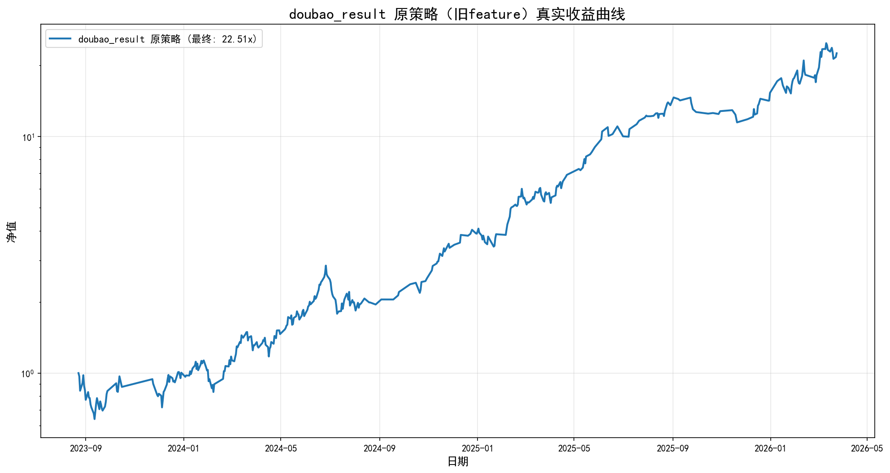

# 完整对比报告（doubao_result vs new_idea）

---

## 1. doubao_result（旧feature）- 真实回测

- 起始日期: 2023-08-23
- 结束日期: 2026-03-24
- 交易天数: 411
- 起始净值: 1.00
- 最终净值: 22.51x
- 总收益: 2151.17%

### 指标

| 指标 | 值 |
|------|-----|
| 总收益 | 2151.17% |
| 年化 | 233.63% |
| 夏普 | 2.90 |
| 最大回撤 | 37.40% |
| 胜率 | 58.54% |

### 收益曲线

---

## 2. new_idea（新feature）- 训练结果

### Top 特征出现次数

- delta_cost_50pct: 17 次
- delta_cost_5pct: 10 次
- delta_cost_15pct: 4 次
- delta_high: 1 次

### 新feature 改进点

**新增特征:**
- 筹码 delta: delta_cost_5pct, delta_cost_15pct, delta_cost_50pct, delta_winner_rate
- 价格 delta: delta_open, delta_close, delta_high, delta_low, delta_pct_chg

### 策略改进思路

**策略2（分位数筛选）:**
- 每日取prob最高的5%
- 保证不空仓，避免踏空

**策略3（特征强化）:**
- score = prob×0.7 + winner_rate×0.2 + (1-chip_concentration)×0.1
- 模型为主，筹码结构验证为辅

---

## 3. 总结与下一步

### 现状

1. **doubao_result（旧feature）**: 完整真实回测，收益 2151.17%，年化 233.63%
2. **new_idea（新feature）**: 完成32个月滚动训练，新增筹码delta和价格delta特征
3. **三种策略（1/2/3）**: 已提出策略改进思路，但 new_idea 完整回测未成功生成（数据池问题）

### 下一步建议

1. 解决 new_idea 回测数据池问题（需要找到完整的回测逻辑）
2. 完成 new_idea 完整回测，生成三种策略的真实交易记录和净值曲线
3. 真实对比新旧feature模型的回测表现
4. 验证策略2和策略3的改进效果
