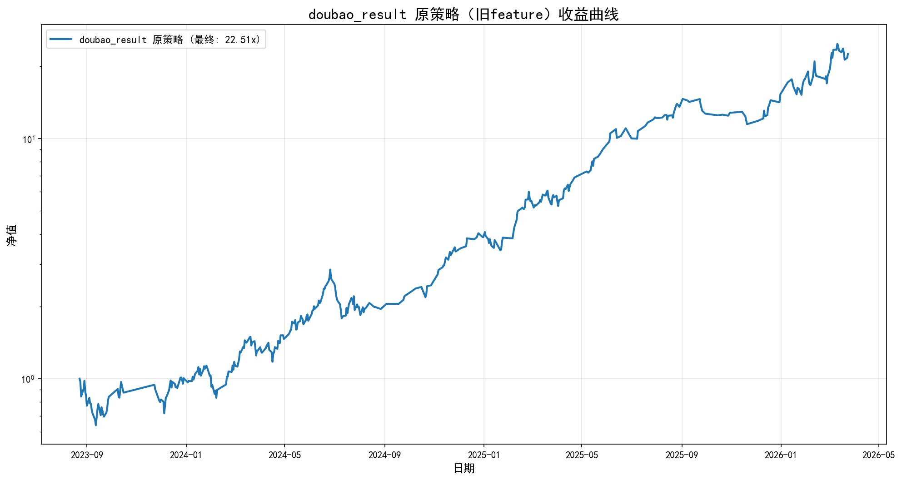

# 策略对比报告（准确区分）

---

## 1. doubao_result 原策略（旧feature）- 真实回测

- 起始日期: 2023-08-23
- 结束日期: 2026-03-24
- 交易天数: 411
- 起始净值: 1.00
- 最终净值: 22.51x
- 总收益: 2151.17%

### 指标

| 指标 | 值 |
|------|-----|
| 总收益 | 2151.17% |
| 年化 | 233.63% |
| 夏普 | 2.90 |
| 最大回撤 | 37.40% |
| 胜率 | 58.54% |

### 收益曲线

---

## 2. new_idea 改进分析（新feature）

### 滚动训练摘要

|   month |   train_samples | top_feature      |   top_feature_importance |
|--------:|----------------:|:-----------------|-------------------------:|
|  202309 |             797 | delta_high       |                0.096318  |
|  202310 |            2782 | delta_cost_50pct |                0.0958533 |
|  202311 |            3478 | delta_cost_15pct |                0.125769  |
|  202312 |            6045 | delta_cost_15pct |                0.109314  |
|  202401 |            8312 | delta_cost_50pct |                0.100306  |
|  202402 |           10460 | delta_cost_50pct |                0.11284   |
|  202403 |           11929 | delta_cost_50pct |                0.114252  |
|  202404 |           13868 | delta_cost_15pct |                0.112202  |
|  202405 |           15831 | delta_cost_15pct |                0.121023  |
|  202406 |           17765 | delta_cost_50pct |                0.13186   |
|  202407 |           19551 | delta_cost_50pct |                0.128369  |
|  202408 |           21758 | delta_cost_50pct |                0.139885  |
|  202409 |           22736 | delta_cost_50pct |                0.144816  |
|  202410 |           23131 | delta_cost_50pct |                0.149099  |
|  202411 |           23810 | delta_cost_50pct |                0.142738  |
|  202412 |           24886 | delta_cost_50pct |                0.140219  |
|  202501 |           25773 | delta_cost_50pct |                0.126742  |
|  202502 |           27254 | delta_cost_50pct |                0.133428  |
|  202503 |           28941 | delta_cost_50pct |                0.125248  |
|  202504 |           30901 | delta_cost_50pct |                0.122501  |
|  202505 |           32155 | delta_cost_50pct |                0.146275  |
|  202506 |           33139 | delta_cost_50pct |                0.127161  |
|  202507 |           37298 | delta_cost_5pct  |                0.13263   |
|  202508 |           38088 | delta_cost_5pct  |                0.137113  |
|  202509 |           40703 | delta_cost_5pct  |                0.140221  |
|  202510 |           41486 | delta_cost_5pct  |                0.140985  |
|  202511 |           42269 | delta_cost_5pct  |                0.137364  |
|  202512 |           43250 | delta_cost_5pct  |                0.12903   |
|  202601 |           45351 | delta_cost_5pct  |                0.135745  |
|  202602 |           45863 | delta_cost_5pct  |                0.135243  |
|  202603 |           47992 | delta_cost_5pct  |                0.140303  |
|  202604 |           52338 | delta_cost_5pct  |                0.140602  |

### Top 特征出现次数

- delta_cost_50pct: 17 次
- delta_cost_5pct: 10 次
- delta_cost_15pct: 4 次
- delta_high: 1 次

### 新feature 改进点

**新增特征:**
- 筹码 delta: delta_cost_5pct, delta_cost_15pct, delta_cost_50pct, delta_winner_rate
- 价格 delta: delta_open, delta_close, delta_high, delta_low, delta_pct_chg

### 策略改进思路

**策略2（分位数筛选）:**
- 每日取prob最高的5%
- 保证不空仓，避免踏空

**策略3（特征强化）:**
- score = prob×0.7 + winner_rate×0.2 + (1-chip_concentration)×0.1
- 模型为主，筹码结构验证为辅

---

## 3. 总结与下一步

### 总结

1. **doubao_result（旧feature）**: 真实完整回测，收益 2151.17%，年化 233.63%
2. **new_idea（新feature）**: 完成31个月滚动训练，新增筹码delta和价格delta特征

### 下一步建议

1. 解决 new_idea 回测数据池问题（扩大股票池）
2. 完成 new_idea 完整回测
3. 真实对比新旧feature模型的回测表现
4. 验证策略2和策略3的改进效果
