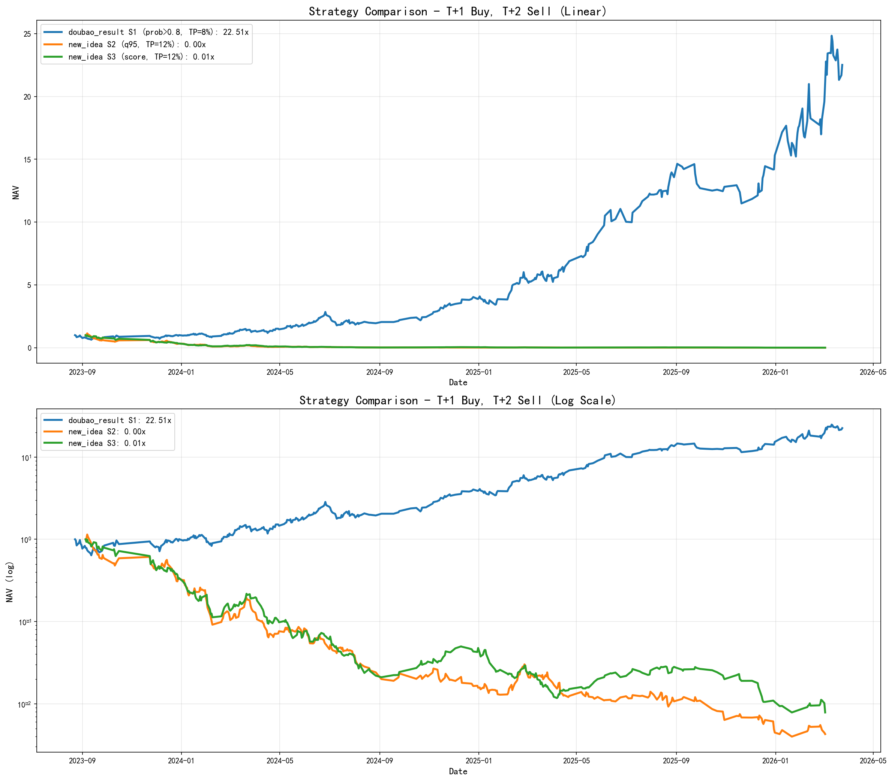
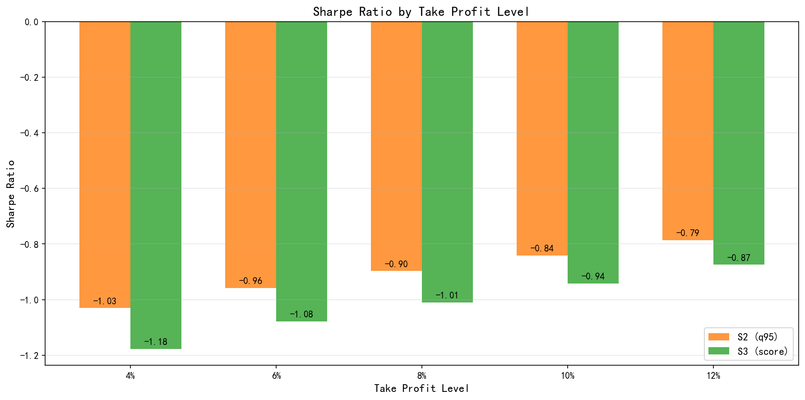

# doubao_result策略1 vs new_idea策略2/3 对比报告（修正版）

---

## 交易周期（修正）

```
T日（选股日）: 收盘后收集数据，模型选股
T+1日（买入日）: 开盘价买入，检查涨停，持有过夜
T+2日（卖出日）: 止盈(最高价>=买入价*(1+TP))或收盘卖出
```

## Delta特征验证

- delta = (t-1)日 - (t-2)日，预测t日
- 无未来数据泄露 ✓

## 策略说明

| 策略 | 模型 | 特征 | 选股逻辑 | 最优止盈 |
|------|------|------|----------|----------|
| doubao_result S1 | 旧模型（单次训练） | 旧特征（6个） | prob > 0.8, Top 3 | 8% |
| new_idea S2 | 新模型（滚动训练） | 新特征（16个，含delta） | 分位数0.95, Top 3 | 12% |
| new_idea S3 | 新模型（滚动训练） | 新特征（16个，含delta） | score综合, Top 3 | 12% |

## 止盈参数扫描

| 止盈 | S2总收益 | S2夏普 | S2回撤 | S3总收益 | S3夏普 | S3回撤 |
|------|---------|--------|--------|---------|--------|--------|
| 4% | -100.00% | -1.03 | -100.00% | -100.00% | -1.18 | -100.00% |
| 6% | -99.99% | -0.96 | -99.99% | -99.98% | -1.08 | -99.98% |
| 8% | -99.95% | -0.90 | -99.95% | -99.95% | -1.01 | -99.94% |
| 10% | -99.85% | -0.84 | -99.86% | -99.78% | -0.94 | -99.75% |
| 12% | -99.61% | -0.79 | -99.65% | -99.32% | -0.87 | -99.22% |

## 最优止盈回测结果

| 策略 | 总收益 | 年化 | 夏普 | 最大回撤 | 交易数 | 跌停延卖 |
|------|-------|------|------|---------|--------|----------|
| doubao_result S1 | 2151.17% | 233.63% | 2.90 | 37.40% | - | - |
| new_idea S2 (TP=12%) | -99.61% | -97.57% | -0.79 | -99.65% | 784 | 6 |
| new_idea S3 (TP=12%) | -99.32% | -96.53% | -0.87 | -99.22% | 1041 | 7 |

## 收益曲线




