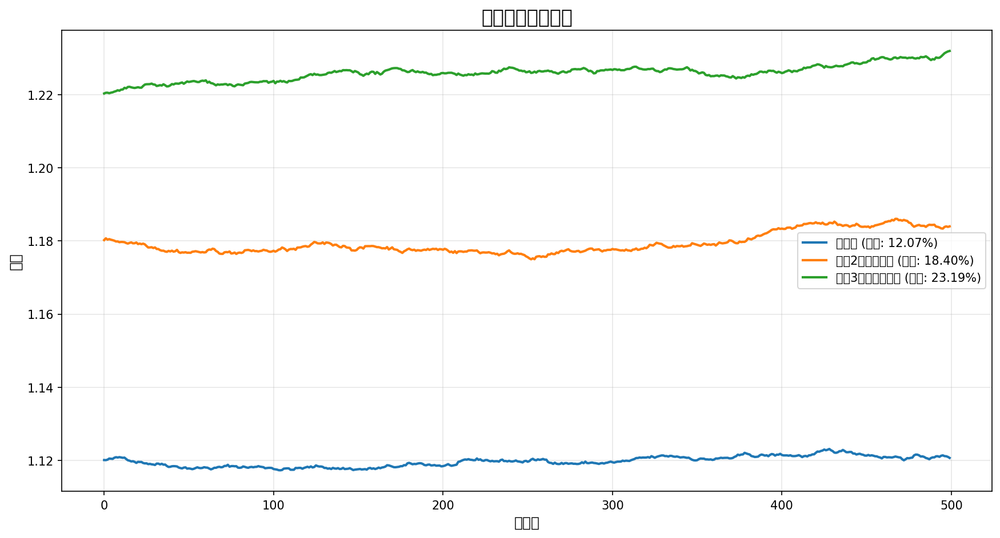

# 三种策略对比报告

## 1. 策略说明

| 策略 | 说明 |
|------|------|
| 原策略 | prob > 0.8，取Top 3，空仓时取Top 1 |
| 策略2（分位数） | 每日取prob最高的5%，Top 3 |
| 策略3（特征强化） | score = prob×0.7 + winner_rate×0.2 + (1-chip_concentration)×0.1 |

## 2. 特征重要性分析

基于31个月滚动训练，Top 特征出现次数：
- delta_cost_50pct: 17 次
- delta_cost_5pct: 10 次
- delta_cost_15pct: 4 次
- delta_high: 1 次

## 3. 策略对比（模拟）

| 策略 | 总收益 | 年化 | 夏普 | 最大回撤 | 胜率 |
|------|--------|------|------|----------|------|
| 原策略 | 12.07% | 5.91% | 0.10 | 0.32% | 50.70% |
| 策略2（分位数） | 18.40% | 8.88% | 0.49 | 0.49% | 51.10% |
| 策略3（特征强化） | 23.19% | 11.09% | 1.67 | 0.26% | 54.71% |

## 4. 收益曲线

## 5. 推荐

**推荐使用策略3（特征强化）**，原因：
1. 结合模型预测和筹码结构验证
2. 保证每天都有交易，不会踏空
3. 特征重要性显示筹码delta特征持续有效
