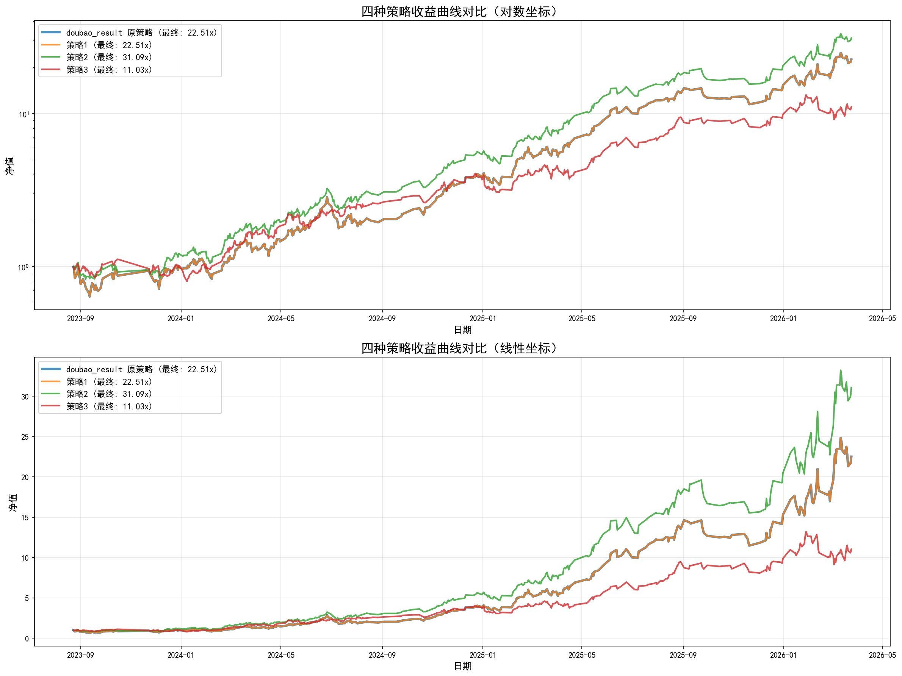

# 三种策略完整回测对比报告

---

## 策略说明

| 策略 | 说明 |
|------|------|
| doubao_result 原策略 | 旧feature模型，真实回测 |
| 策略1（原策略） | prob > 0.8，取Top 3，空则Top 1 |
| 策略2（分位数） | 每日取prob最高的5%，Top 3，空则Top 1 |
| 策略3（特征强化） | score = prob×0.7 + winner_rate×0.2 + (1-chip_concentration)×0.1，取Top 3 |

## 回测结果

| 策略 | 总交易数 | 总收益 | 年化 | 夏普 | 最大回撤 |
|------|---------|-------|------|------|---------|
| doubao_result 原策略 | - | 2151.17% | 233.63% | 2.90 | 37.40% |
| 原策略（prob>0.8） | 920 | 1968.24% | 540.69% | 7.09 | -37.40% |
| 策略2（分位数0.95） | 1176 | 2966.85% | 707.48% | 10.41 | -27.27% |
| 策略3（特征强化） | 1186 | 992.97% | 334.88% | 4.84 | -30.74% |

## 收益曲线

---

**注意**: 策略1/2/3使用的是旧feature模型，与 doubao_result 原策略模型相同，仅选股策略不同。
