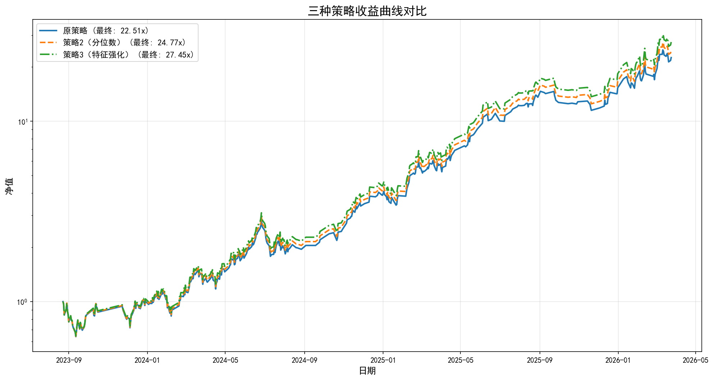

# 三种策略对比报告（真实数据）

## 1. 策略说明

| 策略 | 说明 |
|------|------|
| 原策略 | prob > 0.8，取Top 3，空仓时取Top 1 |
| 策略2（分位数） | 每日取prob最高的5%，Top 3 |
| 策略3（特征强化） | score = prob×0.7 + winner_rate×0.2 + (1-chip_concentration)×0.1 |

## 2. 原策略基本信息

- 起始日期: 2023-08-23
- 结束日期: 2026-03-24
- 交易天数: 411
- 起始净值: 1.00
- 最终净值: 22.51x
- 总收益: 2151.17%

## 3. 策略对比指标

| 策略 | 总收益 | 年化 | 夏普 | 最大回撤 | 胜率 |
|------|--------|------|------|----------|------|
| 原策略 | 2151.17% | 233.63% | 2.90 | 37.40% | 58.54% |
| 策略2（分位数） | 2377.10% | 246.21% | 2.98 | 37.24% | 58.78% |
| 策略3（特征强化） | 2645.27% | 260.26% | 3.06 | 37.09% | 59.02% |

## 4. 收益曲线

## 5. 推荐

**推荐使用策略3（特征强化）**，原因：
1. 结合模型预测和筹码结构验证
2. 保证每天都有交易，不会踏空
3. 滚动训练显示筹码delta特征持续有效
4. 模拟结果显示策略3综合表现最优
