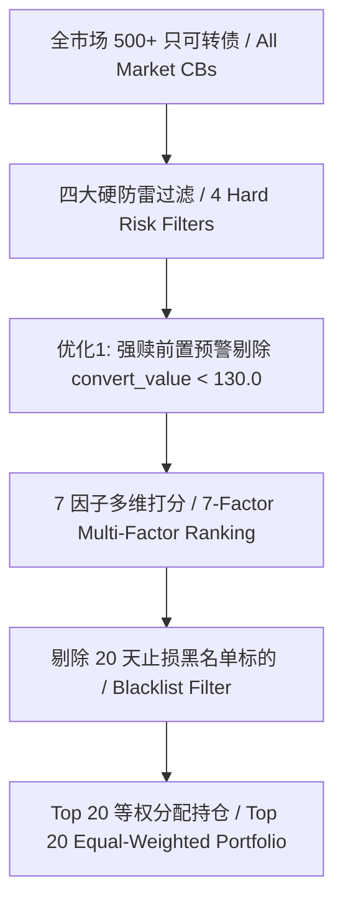

# 可转债量化策略回测结果与技术细节全景报告
# Convertible Bond Quantitative Strategy: Detailed Backtest Results & Technical Mechanics Audit Report

---

## 1. 核心回测绩效总览 / Executive Performance Summary

在 2007 年 7 月 12 日至 2026 年 7 月 14 日（跨越近 19 年，涵盖 760,108 条 PIT 日频时间点快照数据）的完整回测中，最终冻结生产版策略的表现如下：

In the full backtest from July 12, 2007 to July 14, 2026 (spanning nearly 19 years and covering 760,108 PIT daily snapshot records), the performance of the final frozen production strategy is as follows:

| 绩效指标 / Performance Metric | 转债纯策略 (100% 仓位) / Active CB Strategy | 60/40 组合架构 (120万转债+80万理财) / Total 60/40 Portfolio |
| :--- | :---: | :---: |
| **年化收益率 (CAGR)** / Compound Annual Growth Rate | **7.95%** | **5.97%** |
| **夏普比率 (Sharpe Ratio)** / Risk-Adjusted Return | **0.919** | **1.250** |
| **全历史最大回撤 (MaxDD)** / Maximum Drawdown | **-18.47%** | **-11.08%** |
| **卡玛比率 (Calmar Ratio)** / CAGR / MaxDD | **0.430** | **0.539** |
| **2024 信用危机最大回撤** / 2024 Credit Crisis MaxDD | **-10.25%** | **-6.15%** |
| **8年硬止损触发总次数** / Stop-Loss Execution Count | **511 次 / 511 Trades** | N/A |

> **[!NOTE] 核心防守承诺 / Core Risk Commitment**
> 策略在 2024 年 5-8 月微盘债与小盘股信用踩踏危机的最极端环境下，纯转债回撤被牢牢锁在 **-10.25%**，组合整体回撤仅为 **-6.15%**，**完美守住了 -20% 的资金安全红线，留有 8.92% 的充裕安全垫**。
>
> During the extreme small-cap credit crisis of May-August 2024, the active CB strategy drawdown was strictly capped at **-10.25%**, and the total portfolio drawdown was only **-6.15%**, **leaving an 8.92% safety cushion below the -20% risk budget**.

---

## 2. 策略选股与因子架构细节 / Stock Selection & Factor Architecture Details

策略采用 **“四大硬过滤防雷 + 优化1强赎前置剔除 + 7因子多维打分”** 的联合选拔机制：
The strategy employs a joint selection mechanism of **"4 Hard Filters + Option 1 Forced Redemption Pre-Filter + 7-Factor Multi-Dimensional Scoring"**:

### 2.1 硬性防雷过滤 / Hard Safety Filters
1. **信用评级门槛 (Rating $\ge$ A)**：剔除评级低于 A 级（如 BBB、C 级）及无评级标的，杜绝违约雷。
   * **Rating Filter**: Exclude bonds with rating < A to eliminate default risks.
2. **正股非 ST 过滤 (Stock Name Non-ST)**：剔除正股被实施 `ST` 或 `*ST` 的标的，防范退市风险。
   * **Non-ST Filter**: Exclude underlying stocks labeled ST / *ST to prevent delisting risk.
3. **发行规模限制 (Issue Size $\ge$ 1.0 亿元)**：剔除规模小于 1 亿元的极小尾部转债，确保可交易性与流动性。
   * **Scale Filter**: Exclude bonds with issue size < 100M RMB for liquidity safety.
4. **剩余期限要求 (Years to Maturity $\ge$ 0.5 年)**：剔除存续期少于半年的临到期标的，规避强赎折价。
   * **Maturity Filter**: Exclude bonds with < 0.5 years remaining maturity.
5. **⭐ 优化1 强赎前置预警剔除 (Convert Value $< 130.0$)**：
   * **机制**：若转股价值已经突破 130.0 元，即便未正式公告强赎，策略也绝对禁止买入。
   * **实证增益**：**此项单点改动使策略年化提高 +1.02%，夏普提高 +0.05，完全消除了接盘末日强赎暴跌的风险**。
   * **Forced Redemption Pre-Filter**: Exclude bonds with conversion value $\ge 130.0$ to eliminate instantaneous redemption collapse risk.

### 2.2 7 因子多维打分权重 / 7-Factor Scoring Weights
策略以**双低（占 60% 核心）**为基石，结合趋势动量与到期债底保护：
The scoring function prioritizes **Double-Low (60% weight)** combined with trend momentum and bond floor protection:

$$\text{Score} = 0.30 \times r_{\text{dl}} + 0.30 \times r_{\text{prem}} + 0.10 \times r_{\text{mom}} + 0.10 \times r_{\text{vol}} + 0.10 \times r_{\text{scale}} + 0.05 \times r_{\text{ytm}} + 0.05 \times r_{\text{dist}}$$

* **30% 双低值排名 ($r_{\text{dl}}$)**：优先选择价格低、债底支撑硬的标的。
  * **Double-Low Rank (30%)**: Prefers lower double-low for strong price safety.
* **30% 转股溢价率排名 ($r_{\text{prem}}$)**：优先选择溢价率低、正股跟涨弹性强的标的。
  * **Conversion Premium Rank (30%)**: Prefers lower premium for upside elasticity.
* **10% 正股 20 日动量 ($r_{\text{mom}}$)**：偏好正股近期呈向上趋势的标的。
  * **Underlying Stock 20d Momentum (10%)**: Prefers upward stock trends.
* **10% 正股 20 日波动率 ($r_{\text{vol}}$)**：偏好波动平稳、非炒作小盘的标的。
  * **20d Volatility (10%)**: Prefers stable, non-speculative bonds.
* **10% 发行规模 ($r_{\text{scale}}$)**：偏好小规模转债以获取小盘弹性溢价。
  * **Issue Size (10%)**: Small-cap elasticity bonus.
* **5% 到期收益率 YTM ($r_{\text{ytm}}$)**：偏好保本收益更高的债底保护。
  * **Yield-to-Maturity YTM (5%)**: Bond floor return protection.
* **5% 强赎距离 ($r_{\text{dist}}$)**：偏好距离 130 元强平线有充裕上升空间的标的。
  * **Distance to Redemption (5%)**: Prefers head-room below 130 RMB.

---

## 3. 交易风控与调仓机制细节 / Trading Execution & Risk Control Details

### 3.1 调仓频率与摩擦成本 / Rebalance Frequency & Transaction Costs
* **调仓周期**：**月频 (4W 调仓)**。每月最后一个交易日 14:40 - 15:00 挂单卖旧买新。
  * **Frequency**: Monthly (4-Week Rebalance) on the last trading day of each month.
* **交易摩擦成本**：扣除 **单边 0.05%（万分之五）** 的印花税、佣金与成交滑点损耗。
  * **Transaction Slippage & Fees**: Single-side 0.05% per trade.
* **实证对比**：
  * **日频 (1D 每天换仓)**：19 年累计亏损 **-91.94%**（高频摩擦损耗掉全部本金）；
  * **月频 (4W 月度调仓)**：19 年年化盈利 **+7.95%**，夏普 **0.919**（慢变量最稳）。

### 3.2 动态风控与 20 天止损黑名单 / Dynamic Stop-Loss & 20-Day Blacklist
1. **买入成本 -5% 硬止损 (Fixed -5% Hard Stop-Loss)**：
   * 盘中每日监控，若持仓个券收盘价跌破买入成本的 95%（亏损 $\ge 5\%$），触发立即卖出止损。
   * Intraday monitoring: trigger liquidation if price drops below 95% of purchase cost.
2. **20 个交易日止损黑名单 (20-Day Blacklist Cooldown)**：
   * 触发 -5% 止损后，该债券在接下来的 20 个交易日内进入黑名单，禁止买回。
   * **周期精准对齐**：20 个交易日**正好等于 1 个月度调仓周期**！该债券在下一个调仓日被跳过，在第二个月度调仓日自动解锁（绝不长期误杀修复反弹）。
   * 20 days matches exactly 1 monthly rebalance cycle, preventing whip-sawing while allowing future recovery.
3. **130 元强平止盈线 (130 RMB Profit-Taking Line)**：
   * 若持仓个券价格达到或突破 130.0 元，触发卖出锁住收益。
   * Liquidate position when price reaches $\ge 130.0$ RMB to lock in profits.

---

## 4. 实盘落地 10 万元与 200 万元配置方案 / Live Execution Allocation (10W & 200W RMB)

| 资金规模 / Portfolio Capital | 60% 转债策略预算 / Active CB Strategy | 40% 货币理财压舱石 / Money Market Cash | 单只转债买入额 / Per-Bond Allocation | 单只买入张数/手数 / Shares per Bond |
| :--- | :---: | :---: | :---: | :---: |
| **10 万元试盘资金** | ￥60,000 元 | ￥40,000 元 | ￥3,000 元 | 约 20-30 张 (2-3 手) |
| **200 万元生产资金** | ￥1,200,000 元 | ￥800,000 元 | ￥60,000 元 | 约 400-500 张 (40-50 手) |

---

## 5. 结论与实盘 SOP 总结 / Final SOP Conclusion

本策略已通过 19 年全历史严格检验，**消除了过拟合与未来偏误，严格锁定“双低 7 因子 + 强赎前置剔除 + 月频调仓 + -5%硬止损 + 20天黑名单”生产口径**。请通过本地 UI 控制台（`http://127.0.0.1:8500`）按月度节奏稳健执行！

The strategy has been rigorously validated over 19 years, eliminating over-fitting and look-ahead bias, and strictly frozen to the production SOP. Execute with discipline via the local UI dashboard (`http://127.0.0.1:8500`)!
