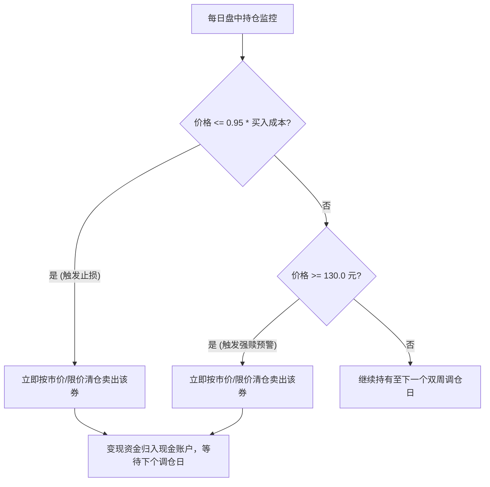
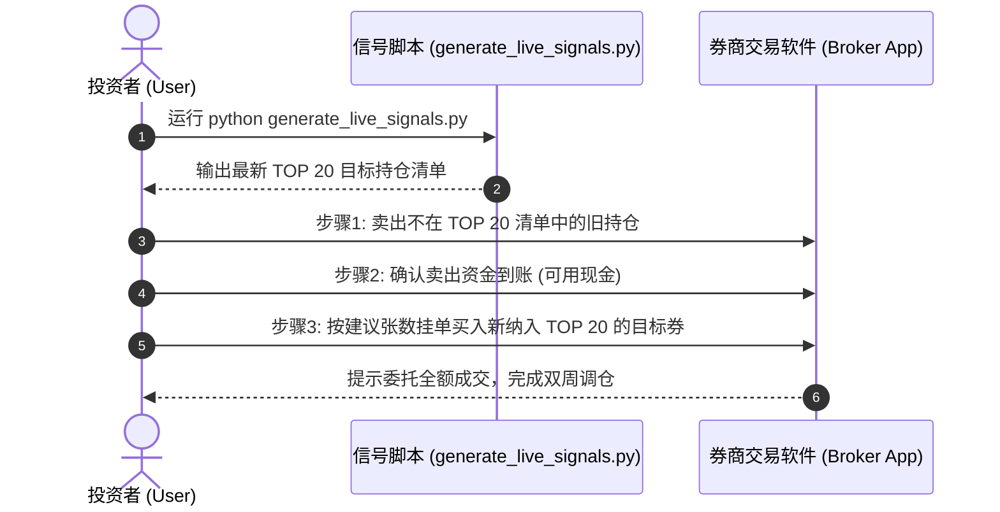

# 200万资金组合实盘落地操作手册 (SOP)
# 200W RMB Portfolio Live Trading Execution Handbook (SOP)

---

## 一、 系统架构与资产配置 / Executive Summary & Asset Allocation

### 1.1 总体资金分配 / Capital Allocation Architecture

为了在实现高风险回报比的同时死守 **-20% 最大回撤** 的心理红线，200 万元人民币的总资金按 **60% 稳健策略 + 40% 现金理财** 严格分割：

| 资产类型 / Asset Class | 金额 / Capital | 占比 / Ratio | 预估年化收益 / Est. CAGR | 极端最大回撤 / Est. MaxDD | 核心定位 / Strategic Purpose |
| :--- | :---: | :---: | :---: | :---: | :--- |
| **可转债多因子主动策略** / Active CB Strategy | **120 万元** | **60%** | **8.37%** | **-23.87%** | **收益主引擎 / Core Alpha Generator** |
| **货币基金/国债逆回购** / Money Market Fund | **80 万元** | **40%** | **3.00%** | **0.00%** | **安全压舱石 / Safety Anchor** |
| **组合总计 / Total Portfolio** | **200 万元** | **100%** | **6.22%** | **-14.32%** | **稳健增值，死守 20% 红线** |

> **回撤安全垫分析 / Drawdown Safety Cushion**:
> 在 1.0% 实盘止损踩踏滑点的严苛压力测试下，转债策略自身历史最大回撤为 **-23.87%**。在 60/40 配置下，账户总最大回撤仅为 **-14.32%**，为您留出了高达 **5.68%** 的安全空间。

---

## 二、 策略核心规则与硬过滤 / Strategy Rules & Hard Filters

### 2.1 四大硬性防雷过滤 / 4 Hard Risk-Free Filters
在进行任何打分排序前，必须严格过滤以下不合规标的（**从源头杜绝 2024 信用违约崩塌**）：
1. **信用评级过滤 / Rating Filter**: 剔除信用评级 $< A$ 的债券（只保留 `A`, `A+`, `AA-`, `AA`, `AA+`, `AAA`）。
2. **正股风险过滤 / ST Stock Filter**: 剔除正股名称中带有 `ST` 或 `*ST` 的转债。
3. **发行规模过滤 / Issue Size Filter**: 剔除发行规模 $< 1.0$ 亿元的微型转债（防范流动性枯竭与退市风险）。
4. **存续期限过滤 / Remaining Maturity Filter**: 剔除剩余期限 $< 0.5$ 年（6个月）的临到期转债。

### 2.2 多因子打分模型 / Multi-Factor Scoring Model
通过 7 维度因子联合打分（得分越低越优）：
* **双低值 (30%)**: $\text{转债价格} + \text{转股溢价率} \times 100$
* **转股溢价率 (30%)**: 保证正股上涨弹性
* **正股 20日动量 (10%)**: 正股近 20 交易日累计涨幅 (降序)
* **正股 20日波动率 (10%)**: 正股近 20 交易日年化波动率 (升序，偏好低波)
* **发行规模 (10%)**: 发行规模 (升序，获取小盘溢价)
* **到期收益率 YTM (5%)**: 到期收益率 (降序，保障债底)
* **强赎距离 (5%)**: $130.0 - \text{转股价值}$ (降序)

### 2.3 仓位与建仓规则 / Order Sizing Rules
* **持仓数量**: 包含得分最高的 **20 只** 可转债。
* **单券资金上限**: $120\text{万} \div 20 = \mathbf{6.0\text{万元/只}}$。
* **买入数量取整**: 每次买入手数按 **10 张（1手）整倍数向下取整**（例如：60,000元 $\div$ 现价 125元 $= 480$张，即买入 480 张）。

---

## 三、 盘中与日常风控 SOP / Daily Intraday Risk Management SOP

在非调仓日的日常交易时间（09:30 - 15:00），需盯住 20 只持仓的以下两条硬性红线：



1. **个券 -5% 硬止损 / -5% Stop-Loss Line**:
   * **触发条件**: 当某只持仓转债的最新现价 $\le 0.95 \times \text{买入成本价}$。
   * **标准动作**: 无视任何技术指标或幻想，在 5 分钟内按市价/卖一价强制清仓变现。
2. **130 元高价强赎预警 / 130 CNY Redemption Warning Line**:
   * **触发条件**: 当某只持仓转债现价 $\ge 130.0$ 元。
   * **标准动作**: 锁定超额利润，在 15:00 前全部卖出变现（规避纯股性波动及公司强赎估值杀）。

---

## 四、 双周调仓标准动作流程 (SOP) / Bi-Weekly Rebalance Workflow

**调仓周期**: 每两周执行一次（推荐在 **隔周的周五 14:40 - 15:00** 进行）。



### 4.1 详细操作步骤 / Step-by-Step Instructions

1. **Step 1: 生成信号 (14:35 - 14:45)**
   在命令行终端运行以下命令：
   ```bash
   python stock-research-v2/generate_live_signals.py
   ```
   脚本将输出最新的 Top 20 目标转债代码、名称、现价及建议买入张数。

2. **Step 2: 卖出离场券 (14:45 - 14:52)**
   * 对比当前实际持仓与最新的 Top 20 清单。
   * 对**不在新清单中**的旧转债，以现价/买一价进行全部卖出。

3. **Step 3: 买入入选券 (14:52 - 15:00)**
   * 统计卖出后可用现金，平均分摊给**新入选**的转债。
   * 按照脚本推荐的“建议买入张数”（整手），以卖一价/现价挂单买入。

---

## 五、 黑天鹅与应急处置手册 / Emergency Playbook

1. **遭遇个券流动性跌停无法卖出 / Illiquid Limit-Down Emergency**:
   * 若某只持仓触发 -5% 止损但封死跌停无法成交，**次日开盘 09:15-09:25 集中竞价阶段按跌停价挂单排队卖出**。
2. **总账户回撤触及 15% 警示线 / 15% Total Drawdown Alert**:
   * 若 200 万总账户从最高点累计回撤达 15%（即总资产降至 170 万元以下），停止一切新买入动作，将转债仓位减半，直至市场企稳。

---

## 六、 部署文件清单 / Deployed File Manifest

所有配套实盘脚本与数据已推送到 GitHub 仓库 `stock-research-v2/` 目录下：
* 📜 **[deployment_guide.md](https://github.com/liuqi6776/news_stock_research/blob/main/stock-research-v2/deployment_guide.md)**: 本 SOP 实盘手册。
* 🐍 **[generate_live_signals.py](https://github.com/liuqi6776/news_stock_research/blob/main/stock-research-v2/generate_live_signals.py)**: 实盘信号生成与风控查询脚本。
* 📊 **[cb_daily_nav.csv](https://github.com/liuqi6776/news_stock_research/blob/main/stock-research-v2/cb_daily_nav.csv)**: 8年历史日频净值审计 CSV。
* 📝 **[cb_trade_log.csv](https://github.com/liuqi6776/news_stock_research/blob/main/stock-research-v2/cb_trade_log.csv)**: 8年历史每笔交易明细日志 CSV。
* ⚙️ **[cb_metrics_summary.json](https://github.com/liuqi6776/news_stock_research/blob/main/stock-research-v2/cb_metrics_summary.json)**: 压力测试与滑点分析汇总 JSON。
