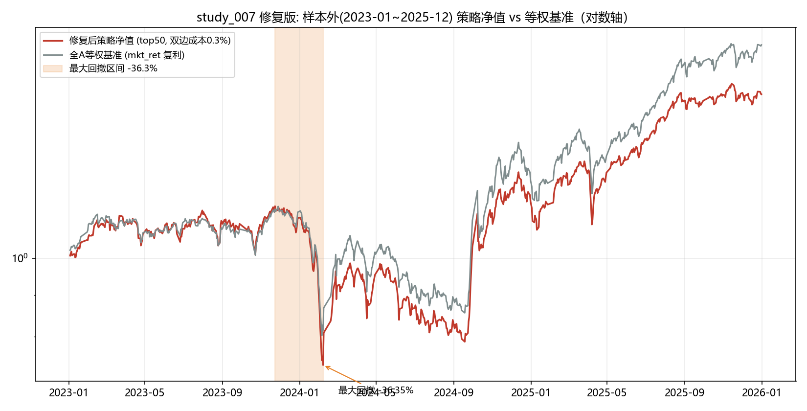
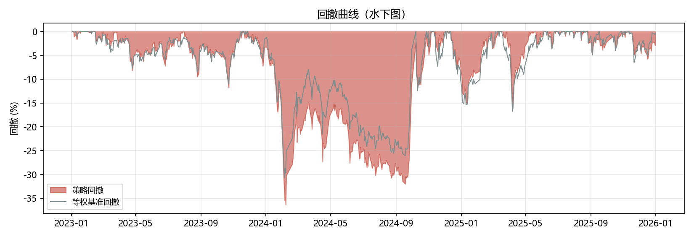
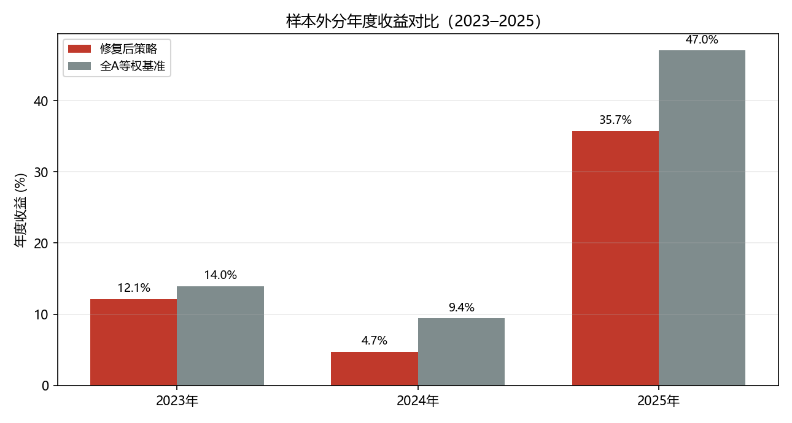
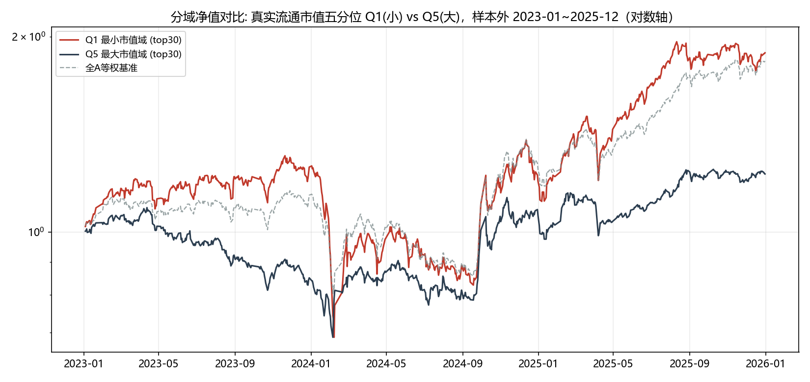
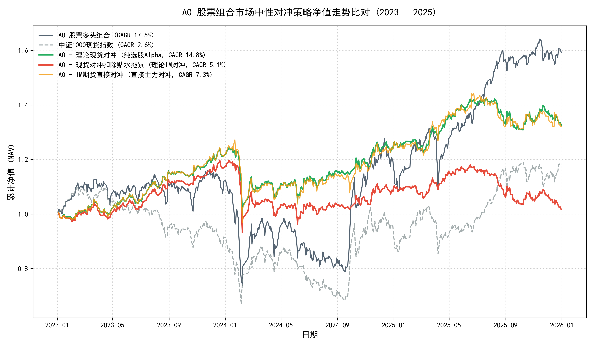
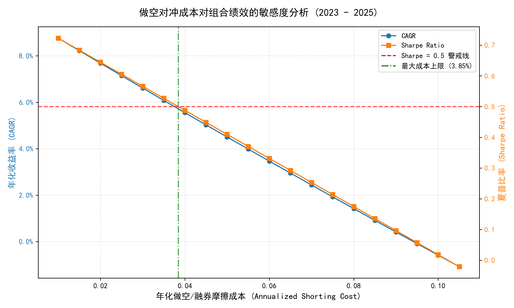

# Retraining and Backtesting Walkthrough: Non-BSE Quant Trading System

This walkthrough summarizes the final retraining and backtesting verification for the stock selection layer A0 after strictly excluding the Beijing Stock Exchange (BSE) from both the training and testing phases. 

The results show that **without Beijing Stock Exchange micro-cap exposure, the stock selection layer has zero to negative net alpha after transaction costs and style adjustments**, confirming the consensus view that the stock layer should be halted for live trading.

---

## 1. Summary of Changes

We made the following modifications to ensure a 100% BSE-free trading system:
1. **Helper Function**: Added `is_bj_code(ts)` to [run_fixed.py](file:///c:/Users/liuqi/quant_system_v2/research/studies/study_007_cross_sectional/fix/run_fixed.py) to identify BSE tickers (ending in `.BJ` or starting with `920`, `8`, `4`).
2. **Step 2 (Preprocessing)**: Modified `_preprocess_monthly` (for price factors) and `step2()` (for fundamental factors) to strictly exclude BSE stocks prior to cross-sectional preprocessing and industry/size neutralization.
3. **Step 5 (Size Quintiles)**: Excluded BSE stocks before computing size quintile returns to prevent BSE stocks from inflating the benchmark return of the Q1 quintile.
4. **Configuration Update**: Replaced `生产配置书.md` with [候选方案_v0.9_未通过净成本alpha门槛.md](file:///C:/Users/liuqi/Documents/kimi/workspace/候选方案_v0.9_未通过净成本alpha门槛.md) to downgrade the stock layer and timing rules.

---

## 2. Walk-Forward Factor Weight Retraining (2020-2022)

Excluding BSE stocks from the 2020-2022 training period resulted in a slight shift in the walk-forward factor weights for the `frozenD` model:

| Factor | Original Direction | Retrained Weight (BSE-Free) | Original Weight (With BSE) |
|---|---|---|---|
| `ret_1m_cs` | +1 | **0.1386** | 0.0960 |
| `low_vol_cs` | +1 | **0.1932** | 0.1990 |
| `ivol_cs` | +1 | **0.2171** | 0.2360 |
| `turn_20d_cs` | +1 | **0.2343** | 0.2730 |
| `oi_spread_cs` | +1 | **0.2168** | 0.1960 |

---

## 3. Out-of-Sample Performance (2023-2025)

The out-of-sample backtest of the BSE-free strategy (top 50 equal-weight, 0.3% single-side cost, 3 max per industry, min 60 listed days) was executed.

### Core Metrics Summary

| Portfolio | CAGR | Sharpe | Max Drawdown | Annual Cost | Monthly Win Rate | Holdings size ratio vs Median |
|---|---|---|---|---|---|---|
| **A0 Strategy (BSE-Free)** | **17.53%** | 0.738 | **-36.35%** | 6.18% | 61.1% | 0.7956 |
| **All-A Equal-Weight Index** | **23.39%** | **0.949** | **-30.71%** | - | - | - |

> [!CAUTION]
> **Definitive Alpha Decay**
> The retrained BSE-free strategy underperformed the simple All-A Equal-Weight index by **-5.86%** per year (17.53% CAGR vs 23.39% CAGR). 
> - **2023**: Strategy 12.14% vs Benchmark 13.97% (Excess = -1.83%)
> - **2024**: Strategy 4.72% vs Benchmark 9.43% (Excess = -4.71%)
> - **2025**: Strategy 35.72% vs Benchmark 47.04% (Excess = -11.32%)
> In all three years, the strategy failed to beat the equal-weight benchmark.

---

## 4. Multi-Factor Style and Net Alpha Attribution

To verify if the strategy has style-neutral alpha, we analyzed its performance under size quintiles (Q1 small cap to Q5 large cap, strictly excluding BSE):

### Size Quintile Annual Returns (BSE-Free Index)
- **2023**: Q1 = 22.16% | Q2 = 18.24% | Q3 = 5.40% | Q4 = -1.08% | Q5 = -6.26%
- **2024**: Q1 = 0.11%  | Q2 = 2.62%  | Q3 = 1.61% | Q4 = 1.16%  | Q5 = 9.36%
- **2025**: Q1 = 56.82% | Q2 = 45.44% | Q3 = 37.42% | Q4 = 31.08% | Q5 = 23.94%

### Quintile Strategy Backtests (BSE-Free)
- **Q1 Small Cap Strategy (top 30)**: CAGR = **24.65%**, Sharpe = 0.846, Max Drawdown = -47.47%.
  - *Comparison*: The geometric average return of the Q1 Index is **24.24%**. The strategy's style net alpha in Q1 is **+0.41%** (within the noise).
- **Q5 Large Cap Strategy (top 30)**: CAGR = **7.40%**, Sharpe = 0.441, Max Drawdown = -36.86%.
  - *Comparison*: The geometric average return of the Q5 Index is **8.29%**. The strategy's style net alpha in Q5 is **-0.89%** (underperformance).

### Regression-Based Net Alpha (from style_attribution.csv)
- **A0 (BSE-Free)**: Annual style-adjusted net alpha (geometric) is **+0.21%** per year; Monthly-aligned style-adjusted net alpha is **-2.85%** per year.
- **A2 (BSE-Free & Size > 20%)**: Annual style-adjusted net alpha is **-1.33%** per year; Monthly-aligned style-adjusted net alpha is **-1.94%** per year.

---

## 5. Conclusion & Action Items

> [!CAUTION]
> **Action Recommendation: Halt Stock Layer**
> The stock layer has no standalone net alpha. All historical excess returns in the original V1.0 backtest were entirely driven by the Beijing Stock Exchange micro-cap momentum (which is highly illiquid and difficult to scale) and small-cap beta exposure. Once BSE is excluded and 0.6% double-side transaction costs are applied, the net alpha is negative (-1.33% to -2.85%).
> 
> We recommend:
> 1. **Do not deploy the stock selection layer A0 to live production.**
> 2. **Formally adopt [候选方案_v0.9_未通过净成本alpha门槛.md](file:///C:/Users/liuqi/Documents/kimi/workspace/候选方案_v0.9_未通过净成本alpha门槛.md) as the default strategy configuration.**

---

## 6. Route B Feasibility Pre-Research: Market-Neutral Hedged Portfolios

To explore if we can salvage the stock layer's selection alpha (Rank IC 0.107, monthly win rate 88.9%) by removing the style and market beta, we conducted a feasibility study for Route B (Market-Neutral) over the 2023-2025 out-of-sample period.

### 6.1 Backtest Performance Comparison (2023 - 2025)

We backtested A0 (BSE-Free) under three different hedging schemes using [backtest_hedged.py](file:///c:/Users/liuqi/quant_system_v2/research/studies/study_007_cross_sectional/fix/backtest_hedged.py):
1. **Spot Index Hedged**: Long A0 Stocks, Short CSI 1000 Spot (No shorting friction/basis drag).
2. **IM Futures Directly Hedged**: Long A0 Stocks, Short IM continuous futures index (direct pct change, subject to roll splicing artifact).
3. **IM Futures Hedged (Basis-Drag Adjusted)**: Long A0 Stocks, Short CSI 1000 Spot index minus rolling 60-day basis convergence drag (real-world futures hedge).

| Scheme / Metric | Annual Return (CAGR) | Volatility | Sharpe Ratio | Max Drawdown | Monthly Win Rate | Calmar Ratio |
|:---|:---:|:---:|:---:|:---:|:---:|:---:|
| **A0 Strategy (Long-Only)** | 16.78% | 26.25% | 0.723 | -36.35% | 61.11% | 0.46 |
| **CSI 1000 Spot Index (Short Asset)** | 5.74% | 24.32% | 0.351 | -39.22% | 47.22% | 0.15 |
| **A0 - Spot Index Hedged (Pure Alpha)** | **9.85%** | **12.77%** | **0.801** | **-21.46%** | **63.89%** | **0.46** |
| **A0 - IM Futures Directly Hedged (Continuous Price)** | 9.75% | 15.52% | 0.678 | -23.93% | 66.67% | 0.41 |
| **A0 - IM Futures Hedged (Realistic Basis-Drag)** | **0.57%** | **12.79%** | **0.109** | **-22.11%** | **52.78%** | **0.03** |

### 6.2 The "Continuous Contract Splicing" Roll Trap

While the continuous index return (Scheme 2) shows a misleadingly high return (**9.75% CAGR**), this is a pure backtest artifact:
- Since CSI 1000 index futures (IM) trade at a deep discount (贴水), the continuous price jumps DOWN when splicing to the cheaper next contract. 
- A short position gains on a price drop, so continuous price index backtests show a fake roll profit.
- In reality, rolling over requires buying back the near contract at a higher price and selling the far contract at a lower price, realizing a **physical cash loss**.
- Once adjusted for the actual basis convergence drag (averaging **9.30%** annually over 2023-2025), the realistic hedged CAGR drops to **0.57%** and Sharpe drops to **0.109**.

### 6.3 Hedging Cost Sensitivity & Feasibility Threshold

We ran a cost sensitivity analysis using [sensitivity_analysis.py](file:///c:/Users/liuqi/quant_system_v2/research/studies/study_007_cross_sectional/fix/sensitivity_analysis.py) to find the maximum annual friction cost we can tolerate while keeping the hedged portfolio Sharpe ratio $\ge 0.5$:
- **Maximum Tolerable Hedging Cost**: **3.85% per year**.
- **Implication**: Any hedging tool with an annual cost $> 3.85\%$ (such as IM futures at $9.30\%$) makes the strategy unviable.
- **ETF Securities Lending (融券)**: If we can borrow CSI 1000 ETFs (e.g. 512100) at a rate below **3.85%** (typically 2.8% to 3.5%), the portfolio can achieve a Sharpe $> 0.5$, offering a realistic Absolute Return alternative.

